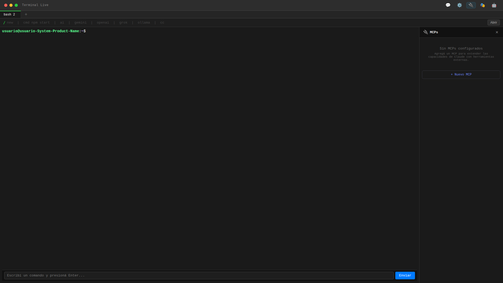
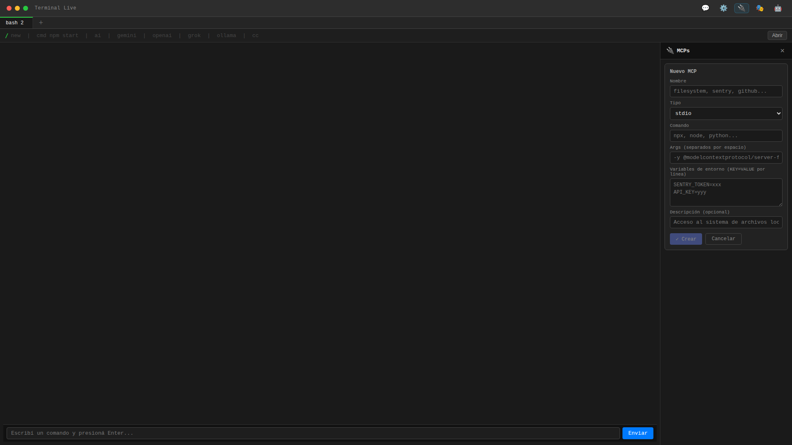
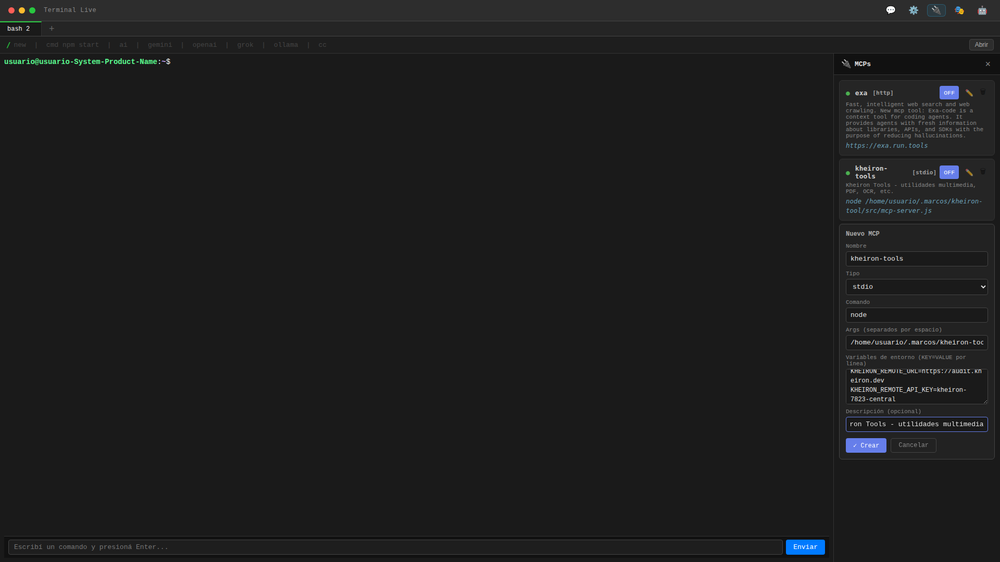
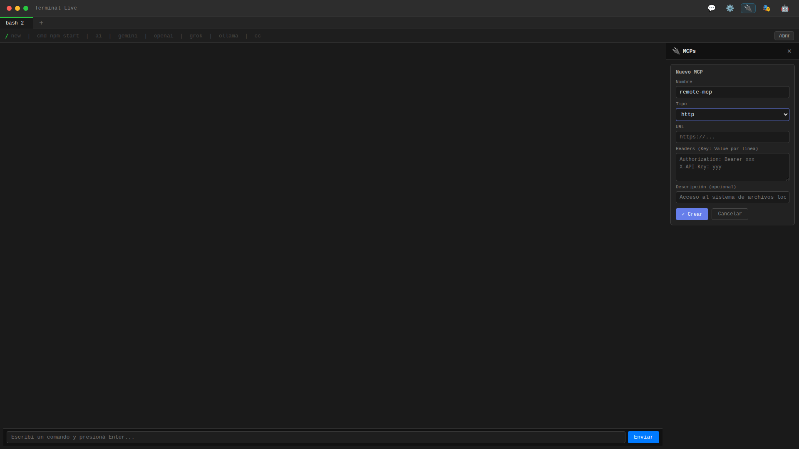
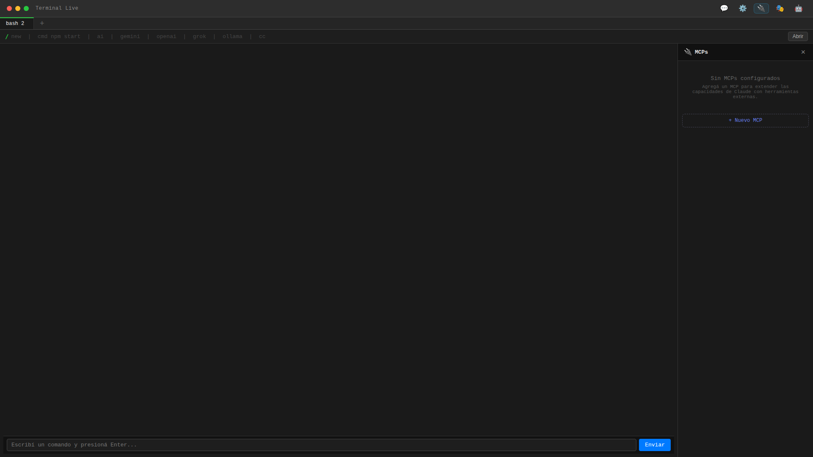
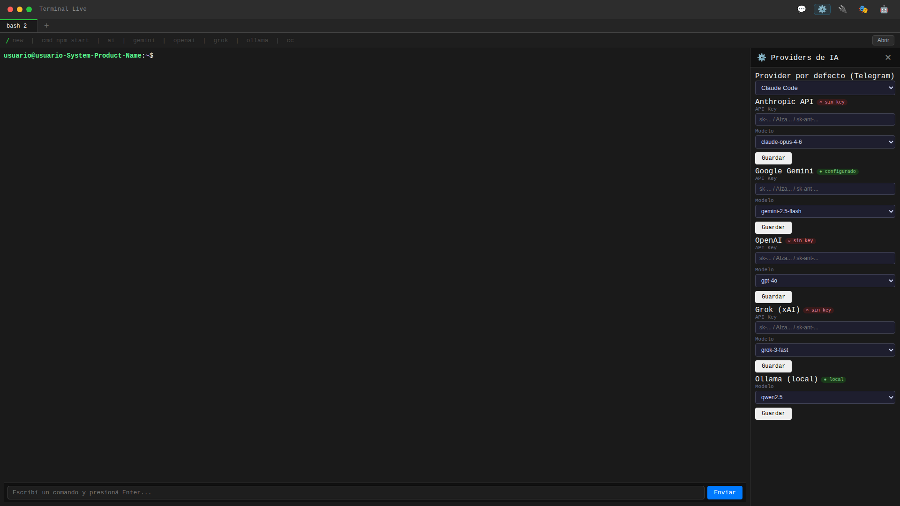
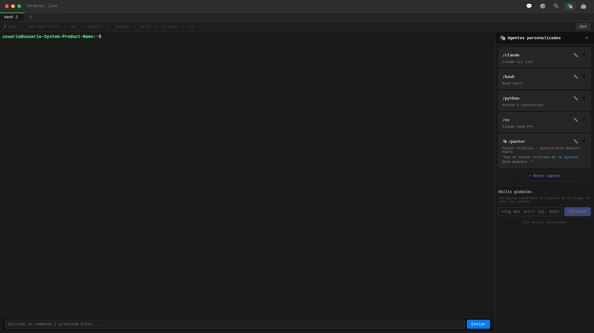
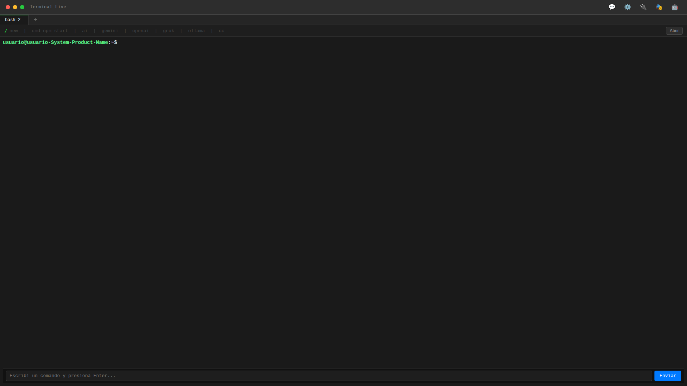
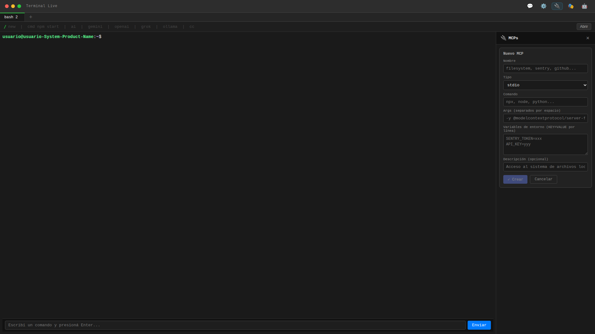

# Reporte E2E — Panel MCPs (Frontend)

**Fecha:** 2026-03-23
**Entorno:** Frontend en `localhost:5173` (Vite + React)
**Backend:** No disponible localmente (server en otro equipo)
**Herramienta de captura:** Kheiron Tools (screenshot con Chromium headless)

---

## 1. Contexto

Se integró `McpsPanel.jsx` (componente ya existente pero desconectado) en `App.jsx`. El cambio consistió en:

- Importar `McpsPanel`
- Agregar estado `mcpsOpen`
- Agregar botón 🔌 en el header (entre ⚙️ Providers y 🎭 Agents)
- Renderizar `<McpsPanel>` condicionalmente
- Garantizar exclusividad mutua con los demás paneles (Providers, Agents, Chat, Telegram)

**Archivo modificado:** `client/src/App.jsx`
**Componente existente:** `client/src/components/McpsPanel.jsx`

---

## 2. Recorrido Visual

### 2.1 — Estado inicial de la aplicación


**Verificaciones:**
- Header muestra 5 botones a la derecha: 💬 (Chat) | ⚙️ (Providers) | 🔌 (MCPs) | 🎭 (Agents) | 🤖 (Telegram)
- El botón 🔌 es nuevo — antes solo había 4 botones
- Terminal funcional con prompt bash visible
- CommandBar inferior con campo de texto y botón "Enviar"

**Estado:** OK

---

### 2.2 — Panel MCPs abierto (estado vacío)



**Verificaciones:**
- Panel lateral derecho con header "🔌 MCPs" y botón X para cerrar
- Mensaje vacío: "Sin MCPs configurados"
- Hint: "Agregá un MCP para extender las capacidades de Claude con herramientas externas."
- Botón "+ Nuevo MCP" visible
- Terminal sigue visible a la izquierda (no se oculta)
- Botón 🔌 tiene estilo `active` (resaltado)

**Estado:** OK

---

### 2.3 — Formulario: Nuevo MCP tipo stdio (vacío)



**Verificaciones:**
- Título: "Nuevo MCP"
- Campo "Nombre" con placeholder "filesystem, sentry, github..."
- Selector "Tipo" con valor default "stdio"
- Campo "Comando" con placeholder "npx, node, python..."
- Campo "Args" con placeholder "-y @modelcontextprotocol/server-filesystem /tmp"
- Textarea "Variables de entorno" con placeholder "SENTRY_TOKEN=xxx\nAPI_KEY=yyy"
- Campo "Descripción (opcional)" con placeholder "Acceso al sistema de archivos local"
- Botón "✓ Crear" (disabled porque nombre está vacío)
- Botón "Cancelar"

**Estado:** OK

---

### 2.4 — Formulario: stdio con datos rellenados



**Verificaciones:**
- Nombre: "kheiron-tools"
- Tipo: stdio
- Comando: "node"
- Args: "/home/usuario/.marcos/kheiron-tools/dist/index.js"
- Variables de entorno: `KHEIRON_REMOTE_URL=https://audit.kheiron.dev` y `KHEIRON_REMOTE_API_KEY=kheiron-7823-central`
- Descripción: "Kheiron Tools - utilidades multimedia"
- Botón "✓ Crear" habilitado (nombre no vacío)

**Estado:** OK — Formulario acepta datos correctamente

---

### 2.5 — Formulario: tipo HTTP



**Verificaciones:**
- Al seleccionar tipo "http", los campos cambian dinámicamente:
  - Desaparecen: Comando, Args, Variables de entorno
  - Aparecen: URL (placeholder "https://..."), Headers (placeholder "Authorization: Bearer xxx\nX-API-Key: yyy")
- Campo Descripción se mantiene
- Nombre: "remote-mcp" (rellenado)
- Transición de campos es instantánea (sin flicker)

**Estado:** OK

---

### 2.6 — Cancelar formulario



**Verificaciones:**
- Al clickear "Cancelar", el formulario se cierra
- Vuelve al estado vacío con "+ Nuevo MCP"
- No queda estado residual (datos no se persisten en UI)

**Estado:** OK

---

### 2.7 — Exclusividad mutua: MCPs → Providers



**Verificaciones:**
- Se abrió MCPs, luego se clickeó ⚙️ (Providers)
- Panel MCPs se cierra automáticamente
- Panel Providers se abre — muestra lista de proveedores (Anthropic, Google Gemini, OpenAI, Grok, Ollama)
- Solo un panel visible a la vez

**Estado:** OK

---

### 2.8 — Exclusividad mutua: MCPs → Agents



**Verificaciones:**
- Se abrió MCPs, luego se clickeó 🎭 (Agents)
- Panel MCPs se cierra automáticamente
- Panel Agents se abre — muestra agentes: /claude, /bash, /python, /cc, /pastor
- Skills globales visibles al fondo
- Solo un panel visible a la vez

**Estado:** OK

---

### 2.9 — Cierre con botón X



**Verificaciones:**
- Después de cerrar con X, la UI vuelve al estado inicial
- No hay panel lateral abierto
- Terminal ocupa todo el ancho disponible
- Botón 🔌 ya no tiene estilo `active`

**Estado:** OK

---

### 2.10 — Validación: nombre vacío



**Verificaciones:**
- Al intentar crear sin nombre, el botón "✓ Crear" está `disabled`
- No se dispara el submit — la validación es preventiva (front-end)
- No se muestra mensaje de error explícito (solo el disabled del botón)

**Estado:** PARCIAL — Funciona pero podría mejorar con un mensaje "El nombre es obligatorio" visible al intentar crear

**Nota:** El código en `McpForm` sí tiene `setError('El nombre es obligatorio')` pero solo se ejecuta si el botón no está disabled. Como el `disabled` previene el click, el error textual nunca se muestra. Es doble validación redundante — el disabled es suficiente, pero el error textual queda muerto.

---

## 3. Hallazgos

### Funcional (OK)
| # | Escenario | Resultado |
|---|-----------|-----------|
| 1 | Botón 🔌 abre/cierra panel | OK |
| 2 | Estado vacío muestra hint + botón crear | OK |
| 3 | Formulario stdio: todos los campos | OK |
| 4 | Formulario http: campos URL + Headers | OK |
| 5 | Cambio dinámico de tipo (stdio ↔ http) | OK |
| 6 | Cancelar formulario limpia estado | OK |
| 7 | Exclusividad mutua con Providers | OK |
| 8 | Exclusividad mutua con Agents | OK |
| 9 | Cierre con X | OK |
| 10 | Botón disabled sin nombre | OK |

### Pendiente (requiere backend)
| # | Escenario | Bloqueador |
|---|-----------|------------|
| 11 | Crear MCP exitoso → aparece en lista | API `/api/mcps` POST |
| 12 | Lista de MCPs existentes | API `/api/mcps` GET |
| 13 | Toggle enable/disable | API `/api/mcps/:name/enable\|disable` |
| 14 | Editar MCP existente | API `/api/mcps/:name` PATCH |
| 15 | Eliminar MCP | API `/api/mcps/:name` DELETE |
| 16 | Error de backend mostrado en UI | Backend devolviendo JSON errors |

### Observaciones de mejora (no bloqueantes)
| # | Observación | Sugerencia |
|---|-------------|------------|
| A | Validación `setError('El nombre es obligatorio')` nunca se ejecuta | Eliminar la validación redundante o quitar el `disabled` y dejar solo el error textual |
| B | No hay validación de campos obligatorios para stdio (Comando) ni http (URL) | Considerar disabled si Comando/URL vacío |
| C | No hay tipo "sse" testeado visualmente | Agregar captura con tipo SSE |
| D | Exclusividad con Chat (💬) y Telegram (🤖) no capturada | Agregar capturas para completar cobertura |

---

## 4. Plan de Pruebas E2E Estrictas

### Suite 1 — Apertura/Cierre
```
P1.1  Click 🔌 → panel MCPs visible
P1.2  Click 🔌 otra vez → panel se cierra (toggle)
P1.3  Click X → panel se cierra
P1.4  Botón 🔌 tiene clase "active" cuando abierto
P1.5  Botón 🔌 NO tiene clase "active" cuando cerrado
```

### Suite 2 — Exclusividad mutua
```
P2.1  MCPs abierto → click Providers → MCPs cerrado, Providers abierto
P2.2  MCPs abierto → click Agents → MCPs cerrado, Agents abierto
P2.3  MCPs abierto → click Chat → MCPs cerrado, Chat abierto
P2.4  MCPs abierto → click Telegram → MCPs cerrado, Telegram abierto
P2.5  Providers abierto → click MCPs → Providers cerrado, MCPs abierto
P2.6  Nunca hay dos paneles visibles simultáneamente
```

### Suite 3 — Formulario stdio
```
P3.1  Click "+ Nuevo MCP" → formulario visible
P3.2  Tipo default = "stdio"
P3.3  Campos visibles: Nombre, Tipo, Comando, Args, Env, Descripción
P3.4  Botón "Crear" disabled si nombre vacío
P3.5  Botón "Crear" enabled si nombre tiene texto
P3.6  "Cancelar" cierra formulario, vuelve a lista
P3.7  Submit válido → POST /api/mcps con body correcto
P3.8  Args se parsean por espacios → array
P3.9  Env se parsea por líneas → objeto KEY=VALUE
```

### Suite 4 — Formulario HTTP/SSE
```
P4.1  Cambiar tipo a "http" → muestra URL + Headers
P4.2  Cambiar tipo a "sse" → muestra URL + Headers
P4.3  Campos Comando/Args/Env ocultos en modo http/sse
P4.4  Volver a "stdio" → muestra Comando/Args/Env
P4.5  Headers se parsean por líneas → objeto Key: Value
P4.6  Submit http → body incluye url + headers + type:"http"
```

### Suite 5 — CRUD (requiere backend)
```
P5.1  GET /api/mcps → lista renderizada con McpRow por cada MCP
P5.2  POST /api/mcps → MCP nuevo aparece en lista
P5.3  PATCH /api/mcps/:name → formulario pre-rellenado, campo nombre readonly
P5.4  DELETE /api/mcps/:name → confirm() → MCP desaparece
P5.5  POST enable → indicador verde, botón "OFF"
P5.6  POST disable → indicador gris, botón "ON"
P5.7  Toggling muestra "..." mientras espera respuesta
```

### Suite 6 — McpRow (visualización)
```
P6.1  MCP habilitado: punto verde ● + botón "OFF"
P6.2  MCP deshabilitado: punto gris ● + botón "ON"
P6.3  Badge tipo visible: [stdio], [http], [sse]
P6.4  Descripción visible si existe
P6.5  Comando + args visible para tipo stdio
P6.6  URL visible para tipo http/sse
P6.7  Botones editar (✏️) y eliminar (🗑) visibles
```

### Suite 7 — Manejo de errores
```
P7.1  Backend caído → lista vacía, no crashea
P7.2  POST falla → muestra error en .ap-error
P7.3  Enable/disable falla → muestra error CLI en cliError
P7.4  Nombre duplicado → error del backend mostrado
P7.5  Timeout de red → manejo graceful
```

---

## 5. Archivos relevantes

| Archivo | Rol |
|---------|-----|
| `client/src/App.jsx` | Montaje del panel, estado, exclusividad mutua |
| `client/src/components/McpsPanel.jsx` | Componente completo: lista, form, CRUD |
| `server/mcps.js` | Backend: CRUD + Smithery + sync con Claude CLI |
| `server/index.js` | Backend: rutas REST `/api/mcps` (implementado por otro equipo) |

---

## 6. Capturas disponibles

| Archivo | Descripción |
|---------|-------------|
| `01-inicio.png` | Vista principal con botón 🔌 en header |
| `02-panel-mcps-abierto.png` | Panel vacío con hint y botón crear |
| `03-form-nuevo-mcp.png` | Formulario stdio vacío |
| `04-form-stdio-lleno.png` | Formulario stdio con datos de kheiron-tools |
| `05-form-tipo-http.png` | Formulario tipo HTTP con URL + Headers |
| `06-cancelar-form.png` | Estado después de cancelar formulario |
| `07-exclusividad-providers.png` | MCPs cerrado, Providers abierto |
| `08-exclusividad-agents.png` | MCPs cerrado, Agents abierto |
| `09-cierre-con-x.png` | Panel cerrado, vista limpia |
| `10-validacion-nombre-vacio.png` | Botón crear disabled sin nombre |
